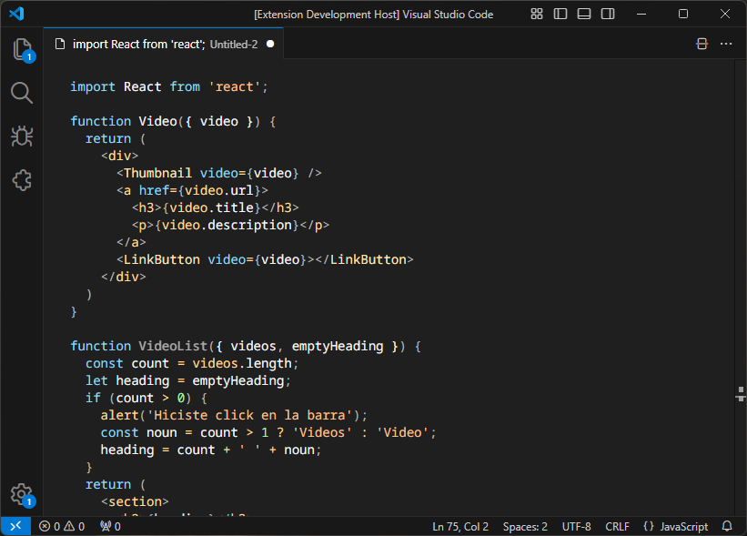

# NestJS Theme for [Visual Studio Code](https://code.visualstudio.com)

## Preview

## Install

[Marketplace - NestJS Color Theme](https://marketplace.visualstudio.com/items?itemName=goodbyte.uy-nestjs-theme)

All about themes [VSCode Themes](https://code.visualstudio.com/docs/getstarted/themes)

## License
[MIT License](https://github.com/goodbyte/vscode-theme-chrome-devtools/blob/master/LICENSE)
